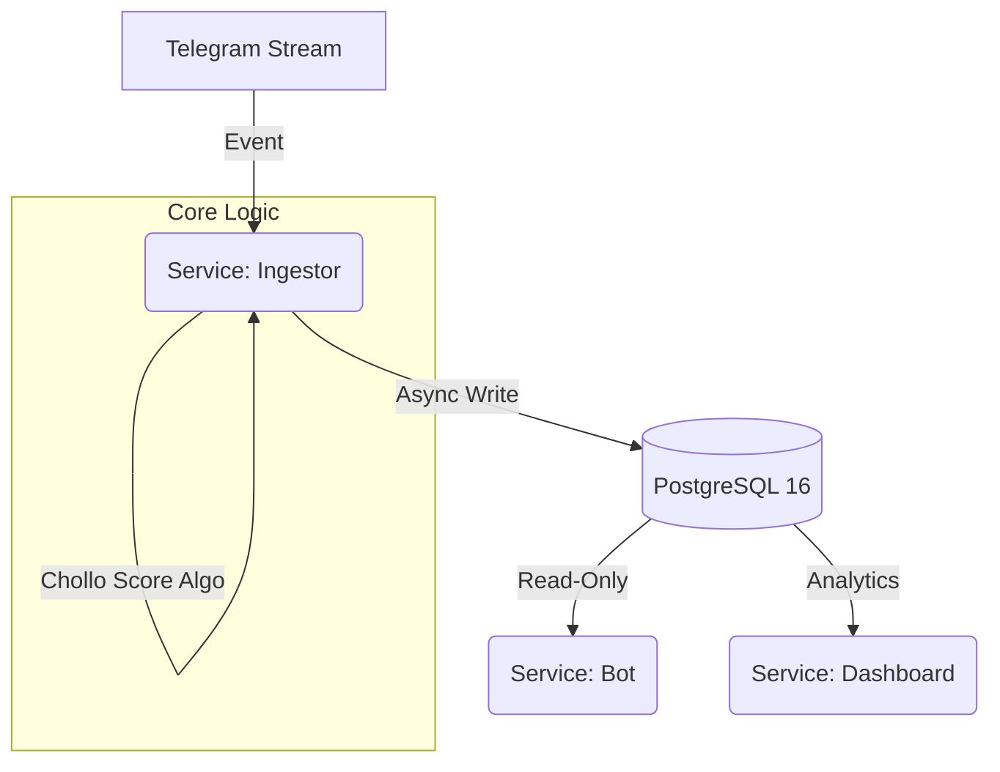

# 🦅 CazaChollos: Intelligent Deal Ingestion Platform


## 📖 Project Vision

**CazaChollos** is a scalable, event-driven architecture designed to monitor high-frequency data streams from Telegram private groups. It ingests, normalizes, and scores e-commerce deals in real-time, exposing actionable data via a Chat Bot and an Administrative Dashboard.

Unlike simple scrapers, this system implements **Zero-Duplication logic**, **Semantic Categorization**, and **Strict Type Safety**.

## 🏗️ System Architecture

The project follows a **Microservices** approach orchestrated via Docker Compose, ensuring Separation of Concerns:



### Core Services
*   **Ingestor (The Listener):** Maintains persistent sessions (`.session` volume), handles parsing via price-parser, and sanitizes URLs to remove tracking parameters.
*   **Database (The Brain):** PostgreSQL 16 optimized with TSVECTOR for Full-Text Search and JSONB support.
*   **Dashboard (The View):** Streamlit app (Port 8501) for real-time KPI monitoring and data exploration.
*   **Bot (The Interface):** Telegram bot offering natural language search capabilities using plainto_tsquery.

## 🧠 Key Technical Features

1.  **Smart Deduplication Strategy**
    To prevent spam and redundant processing, the system generates a unique Content Hash (MD5) based on:
    `MD5(clean_url + price + normalized_title)`
    If the hash exists in the DB unique index, the payload is discarded or updated, ensuring strict data integrity.

2.  **"Chollo Score" Algorithm**
    A custom business logic algorithm (0-100 scale) to rank deal quality:
    $$Score = (Discount_{\%} \times 0.7) + Bonus - Decay$$
    *   **Bonus:** Tier-1 retailers (Amazon, etc.) and explicit "Previous Price" detection.
    *   **Decay:** Time-based score reduction to prioritize fresh deals.

3.  **High-Performance Search**
    Leverages PostgreSQL's native Full-Text Search (FTS). The system converts natural language queries (e.g., "Auriculares Sony baratos") into optimized SQL vectors for instant retrieval.

## 📂 Project Structure (Clean Architecture)

The codebase is organized to support maintainability and scalability:

```text
/
├── app.py                # Streamlit Dashboard Entrypoint
├── docker-compose.yml    # Orchestration (db, ingestor, bot, dashboard)
├── pyproject.toml        # Dependency Management (Poetry)
├── .env.example          # Configuration template
├── /session              # Telegram session storage
├── /migrations           # Alembic versions
├── /src
│   ├── /domain           # Pure Pydantic models & Schemas
│   ├── /infrastructure   # DB Session managers & External APIs
│   ├── /services         # Business Logic (Parser, Scoring, Search)
│   └── /web              # Dashboard Logic
└── /cmd                  # Docker execution scripts
```

## 🚀 Getting Started

### Prerequisites
*   Docker & Docker Compose
*   Python 3.11+ (for local scripts)
*   Telegram API Credentials (from [my.telegram.org](https://my.telegram.org))

### Installation & Configuration

1.  **Clone the repository:**
    ```bash
    git clone https://github.com/darkwerty/cazachollos.git
    cd cazachollos
    ```

2.  **Environment Setup:**
    ```bash
    cp .env.example .env
    ```
    Edit `.env` and fill in your details:
    *   `TELEGRAM_API_ID` & `TELEGRAM_API_HASH`: Get these from my.telegram.org.
    *   `TELEGRAM_ALLOWED_GROUPS`: Comma-separated list of Group/Channel IDs (integers, often starting with `-100`) or Usernames that you want to monitor.
        *   *Tip:* You can find a group's ID by forwarding a message from it to bots like `@userinfobot`.

3.  **Generate Telegram Session:**
    Since the Ingestor runs in Docker (often headless), you must generate the `.session` file locally first to handle the interactive login (phone number & code).

    a. **Install dependencies:**
    ```bash
    pip install poetry
    poetry install
    ```

    b. **Run the Ingestor script locally:**
    ```bash
    poetry run python cmd/run_ingestor.py
    ```

    c. **Follow the instructions:**
    *   Enter your phone number when prompted.
    *   Enter the verification code sent to your Telegram app.
    *   Once you see `Telegram Client Connected` or `Ingestor Service Started`, you can stop the script (Ctrl+C).

    The `cazachollos_ingestor.session` file will be created in the `session/` directory.

### Launch the Stack

1.  **Build and Run:**
    ```bash
    docker-compose up -d --build
    ```

2.  **Apply Migrations (Critical):**
    Initialize the database schema using Alembic:
    ```bash
    docker exec cazachollos_ingestor alembic upgrade head
    ```

3.  **Access the Dashboard:**
    Visit [http://localhost:8501](http://localhost:8501) to view the live data feed, ingestion stats, and score distribution.

## 🛠️ Troubleshooting

**Issue: relation "deals" does not exist**
*   **Cause:** The database container is running but the tables haven't been created yet.
*   **Fix:** Ensure you ran the migration command in step 2 (`alembic upgrade head`).

**Issue: AuthKeyUnregisteredError**
*   **Cause:** The session file is invalid or was revoked/deleted.
*   **Fix:** Delete the file in `session/` and regenerate it using the "Generate Telegram Session" steps above.